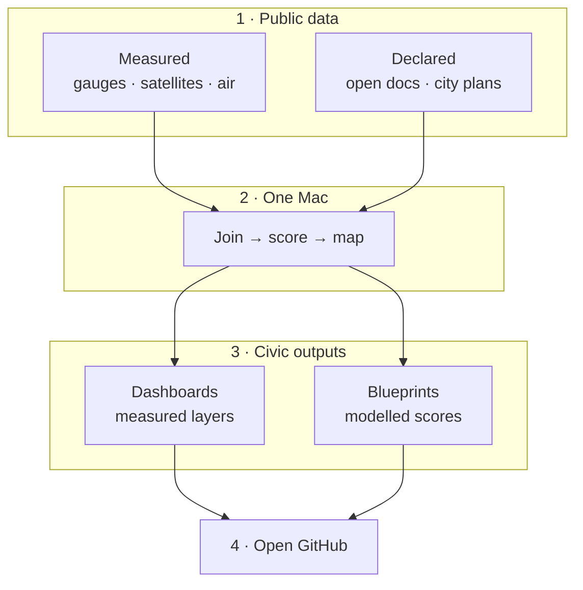
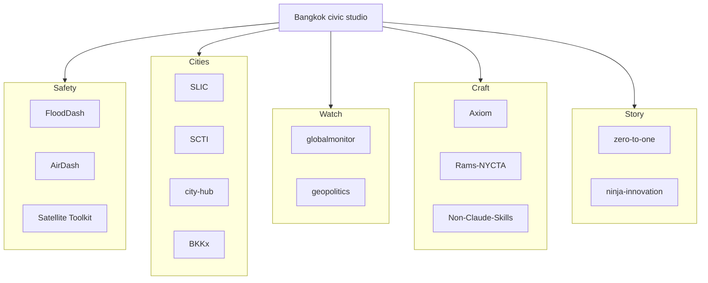

  

<em>Illustration of the civic studio — drawn, not a live operations console or telemetry feed.</em>

### Dr Non / Non Arkaraprasertkul — Bangkok civic studio (Axiom X Co., Ltd.)

One-Mac forkable towers, traceable scores, Thai–English.

> **Fork the method, not the secrets.**

---

## เริ่มที่นี่ตามระดับ · Start here by level

Three doors. Pick the one that matches how you arrived.

**Curious visitor** — walk the room, then read how this account was built.

- [nonarkara.org](https://nonarkara.org) — personal site and studio door
- [Nonarkara/zero-to-one](https://github.com/Nonarkara/zero-to-one) — reconstructable history, from a city-reporter bot (Oct 2024) to an open civic studio

**Builder / engineer** — architecture, kits, and production tactics. Rebuild; do not ask for private source.

- [Nonarkara/FloodDash-Blueprint](https://github.com/Nonarkara/FloodDash-Blueprint) — flood-watch architecture, free data, science, design, roadmap (no source code)
- [Nonarkara/DrNon-Global-Satellite-Toolkit](https://github.com/Nonarkara/DrNon-Global-Satellite-Toolkit) — clone, pick a geography, deploy a satellite/OSINT dashboard
- [Nonarkara/Axiom-Design-Core](https://github.com/Nonarkara/Axiom-Design-Core) — living design system for Axiom X; throw it at an agent
- [Nonarkara/live-coding-bible](https://github.com/Nonarkara/live-coding-bible) — playbook for data-heavy civic dashboards; tactics you can reuse

**City practitioner** — indexes, networks, and a public-data argument you can take into a room.

- [Nonarkara/SLIC-Index](https://github.com/Nonarkara/SLIC-Index) — open city ranking with traceable scores, not a black box
- [Nonarkara/FloodDash-Blueprint](https://github.com/Nonarkara/FloodDash-Blueprint) — bilingual invitation to rebuild a provincial flood picture from public feeds
- [Nonarkara/ascn-smart-cities-network](https://github.com/Nonarkara/ascn-smart-cities-network) — independent ASCN analytics workbench from public ASEAN documents (not an official ASEAN site)
- [Nonarkara/ninja-innovation](https://github.com/Nonarkara/ninja-innovation) — interactive ebook on replacing million-dollar platforms with public data

---

## สตูดิโอทำงานอย่างไร · How the studio works

Public feeds in. One Mac. Dashboards and blueprints out. GitHub is the public shelf — not a request line for unpublished systems.

If a number is **measured**, you should be able to name the sensor, satellite, or station. If it is **modelled**, you should be able to name the formula. Mixed pictures are labelled as mixed.

---

## แผนผังสตูดิโอ · Estate map

One studio, five clusters. Names below are public GitHub repositories.

Short names on the map; links below.

- **Safety** — [FloodDash-Blueprint](https://github.com/Nonarkara/FloodDash-Blueprint) · [airdash](https://github.com/Nonarkara/airdash) · [DrNon-Global-Satellite-Toolkit](https://github.com/Nonarkara/DrNon-Global-Satellite-Toolkit)
- **Cities** — [SLIC-Index](https://github.com/Nonarkara/SLIC-Index) · [smart-city-thailand-index](https://github.com/Nonarkara/smart-city-thailand-index) · [city-hub](https://github.com/Nonarkara/city-hub) · [BKKx](https://github.com/Nonarkara/BKKx)
- **Watch** — [globalmonitor](https://github.com/Nonarkara/globalmonitor) · [geopolitics-dashboard](https://github.com/Nonarkara/geopolitics-dashboard)
- **Craft** — [Axiom](https://github.com/Nonarkara/Axiom) · [Rams-NYCTA-Design-Core](https://github.com/Nonarkara/Rams-NYCTA-Design-Core) · [Non-Claude-Skills](https://github.com/Nonarkara/Non-Claude-Skills)
- **Story** — [zero-to-one](https://github.com/Nonarkara/zero-to-one) · [ninja-innovation](https://github.com/Nonarkara/ninja-innovation)

Safety watches water, air, and orbit. Cities score and atlas places. Watch reads a wider political and economic picture. Craft is how surfaces get built. Story is how the method is taught.

---

## โปรเจกต์เด่น · Featured projects

Real repositories only. One line on why it exists; the repo for how.

- **[SLIC-Index](https://github.com/Nonarkara/SLIC-Index)** — open city ranking with traceable scores. Independent work; fork the method. Live: [slic.nonarkara.org](https://slic.nonarkara.org)
- **[FloodDash-Blueprint](https://github.com/Nonarkara/FloodDash-Blueprint)** — everything needed to rebuild a bilingual flood watch from free public data, without the private source tree. Companion live picture: [flood.nonarkara.org](https://flood.nonarkara.org)
- **[DrNon-Global-Satellite-Toolkit](https://github.com/Nonarkara/DrNon-Global-Satellite-Toolkit)** — clone, pick a geography, deploy. Open satellite/OSINT dashboard framework; independent, not a NASA product
- **[globalmonitor](https://github.com/Nonarkara/globalmonitor)** — independent digital-economy and geopolitical OSINT map; not a depa product. Live: [globalmonitor.pages.dev](https://globalmonitor.pages.dev)
- **[BKKx](https://github.com/Nonarkara/BKKx)** — Bangkok, block by block: heritage atlas and playable city. Live: [bkk.nonarkara.org](https://bkk.nonarkara.org)
- **[Axiom](https://github.com/Nonarkara/Axiom)** — decision systems for cities and operators, from one Bangkok studio. Company door: [axiom.nonarkara.org](https://axiom.nonarkara.org)
- **[zero-to-one](https://github.com/Nonarkara/zero-to-one)** — how this GitHub account was built, with artifacts you can check
- **[ninja-innovation](https://github.com/Nonarkara/ninja-innovation)** — interactive ebook on replacing million-dollar platforms with public data. Live: [ninja.nonarkara.org](https://ninja.nonarkara.org)

Studio door (site + source): [nonarkara.org](https://nonarkara.org) · [Nonarkara/nonarkara.org](https://github.com/Nonarkara/nonarkara.org)

---

## หลักการ · Principles

- **Fork the method, not the secrets.** Architecture, formulas, and public catalogs are here so another team can rebuild. Private implementations stay private.
- **One Mac.** These towers are designed to be computed and operated without a data centre.
- **No black-box rankings.** A score you cannot trace is not a score we publish.
- **Bilingual as audience.** Thai and English are first-class, not a translation layer bolted on later.
- **Civic, not official.** Independent studio work unless a repository documents otherwise. Warnings and policy still belong to the agencies that issue them.

How to open an issue or fork a blueprint without crossing those lines: [CONTRIBUTING.md](CONTRIBUTING.md).

---

## ติดต่อ · Connect

- **Studio door:** [nonarkara.org](https://nonarkara.org)
- **Company:** Axiom X Co., Ltd. — [axiom.nonarkara.org](https://axiom.nonarkara.org)

Bangkok · GMT+7

GitHub pulse — activity snapshot, not a scoreboard

  

